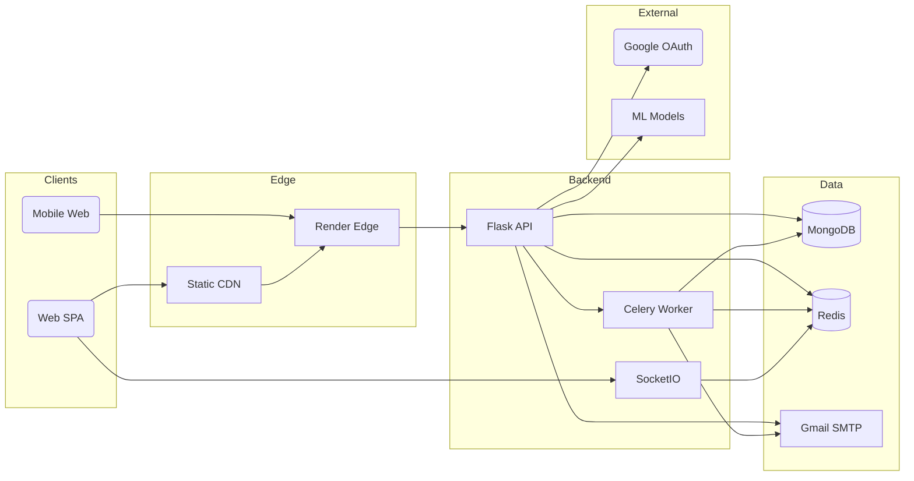
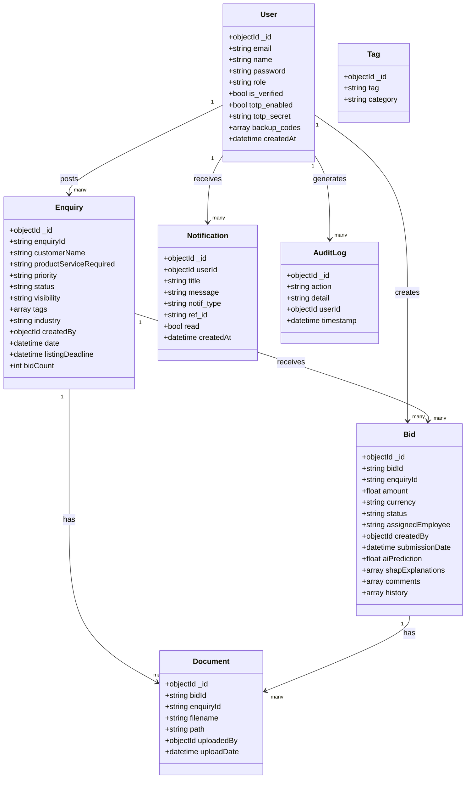
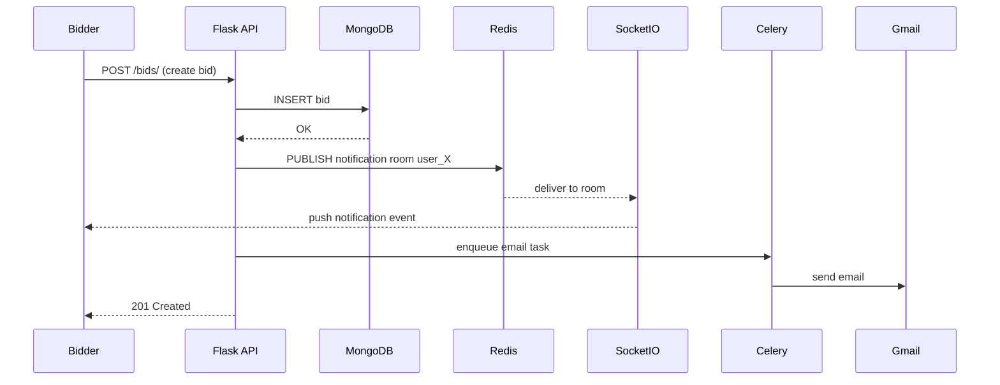
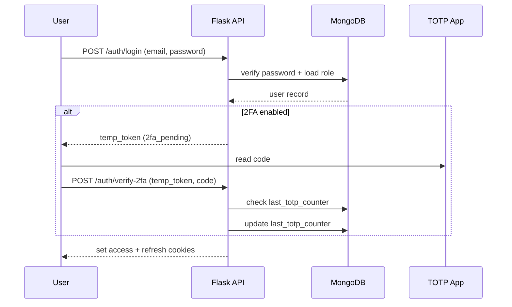

# BidFlow — System Design

> Architecture document for the BidFlow B2B auction/bidding platform.
> Generated with the `system-design-architect` skill. All Mermaid diagrams are
> Excalidraw-compatible (flowchart / sequenceDiagram / classDiagram) — paste
> them into Excalidraw via **More tools → Mermaid to Excalidraw** for editable
> versions.

---

## 1. Requirements & Assumptions

### 1.1 Functional requirements

- **Auth & identity**: Email/password login, registration, JWT sessions in
  httpOnly cookies with CSRF double-submit, Google OAuth, 2FA (TOTP) for Admin,
  email verification, forgot/reset password via emailed token.
- **Enquiries**: Companies post procurement enquiries (customer, product,
  priority, deadline, visibility).
- **Bids**: Sales Executives / Bidders submit bids against enquiries; status
  workflow (Under Review → Order Received / Rejected); comments thread.
- **Marketplace**: Public listing of `public` enquiries; any Bidder can bid.
- **Documents**: Upload + access-controlled download tied to bids/enquiries.
- **Notifications**: Real-time (SocketIO) + persisted notification feed.
- **Analytics & ML**: Win-probability prediction per bid (scikit-learn +
  XGBoost + SHAP explanations), dashboards.
- **Audit log**: Append-only record of sensitive actions.
- **Admin**: User management (reset passwords, list users, role checks).
- **i18n**: Multi-language (en, hi, ar, fr, gu, de, es) UI.
- **Multi-role RBAC**: Admin, Company, Sales Executive, Bidder.

### 1.2 Non-functional requirements (stated assumptions)

| NFR | Assumption |
|---|---|
| Users / DAU | **1,000 DAU** (small B2B SaaS; grows to ~10k in 10x scenario) |
| Requests/sec | ~0.3 QPS avg, ~1 QPS peak (derived in §2) |
| Latency target | p50 < 100 ms API, p99 < 400 ms (excluding ML) |
| Availability | **99.9%** (Render free tier is acceptable for this stage) |
| Durability | MongoDB Atlas 3x replication; user uploads on persistent volume |
| Consistency | Single-region, strong per-document; ML predictions are best-effort |
| Compliance | Email verification + audit log from day one; right-to-erasure = soft delete |
| Team | Small (student/project team); operational simplicity prioritized |

### 1.3 Constraints

- Single full-stack team, Python + React familiarity.
- Deployed on **Render.com** (free tier) + **MongoDB Atlas** + **Upstash Redis**.
- Local dev via **Docker Compose** (mongo, redis, backend, celery, frontend).
- Build-vs-buy: auth is **built** (not a managed IdP) — acceptable because auth
  is not the product differentiator and the team wants full control of the
  bid/role model.

---

## 2. Capacity Estimation

Back-of-the-envelope math (anchors: 86,400 s/day; 1M req/day ≈ 12 QPS).

**Traffic**
- 1,000 DAU × 25 actions/user/day = **25,000 actions/day**
- 25,000 / 86,400 = **0.29 QPS average**, peak ≈ 3× → **~1 QPS**
- Read/write split ≈ **70 / 30** (browsing marketplace dominates reads)

**Storage** (per day → per year, ×3 for MongoDB replication)
- Enquiries: 50/day × 2 KB = 100 KB/day → ~36 MB/year
- Bids: 200/day × 3 KB = 600 KB/day → ~220 MB/year
- Documents: 50/day × 2 MB = **100 MB/day → ~36 GB/year** (dominant cost)
- DB logical total ≈ **~40 GB/year**; doc blob storage is the real growth driver

**Bandwidth**: 1 QPS × 5 KB avg = 5 KB/s — negligible.

**Conclusion the numbers force**: This fits comfortably on **one MongoDB
instance + one Flask worker + one Celery worker**. The current
architecture (monolith + queue + single document store) is correct and
**not premature**. Sharding, microservices, or Kafka would be over-engineering
at this scale. The one component that is *not* trivially cheap is the **ML
prediction (XGBoost + SHAP)** — CPU-bound, see §7 and §9.

---

## 3. High-Level Architecture

*Paste into Excalidraw via More tools → Mermaid to Excalidraw for an editable
version.*

### Walkthrough — primary request path
1. Browser SPA loads static assets from CDN; API calls hit the Render edge →
   Flask API (Gunicorn + gevent).
2. Auth middleware validates the JWT in the httpOnly cookie, reads the user's
   **role from MongoDB** (not the JWT) for authorization (fix applied in
   audit #16).
3. Reads/writes go to MongoDB; rate-limit counters and CSRF/lock state live in
   Redis.
4. Emails (verification, reset, notifications) are handled by Celery on a
   background path (see below), not inline.

### Walkthrough — primary async path
- On **bid submission**, the API persists the bid to MongoDB, then emits a
  SocketIO `notification` event (fan-out to `user_<id>` rooms via Redis
  pub/sub backplane) and enqueues a Celery task to send the email
  notification. The HTTP response returns before email is sent.
- **ML prediction** (`/bids/predict`) loads the XGBoost model + SHAP explainer
  (cached in worker memory) and returns win-probability + factor explanations.

---

## 4. Data Model & Database Choice

### Engine selection
**MongoDB (document store)** is the right default here, justified by the
workload classification:

| Question | Answer | Implication |
|---|---|---|
| Read/write ratio | 70/30, read-heavy browse | Replicas + index on `enquiryId`/`createdBy` |
| Access pattern | by enquiry, by user, by bid | Document-per-entity fits; queries are key/query shaped |
| Consistency | per-document strong | Single-doc atomicity is sufficient |
| Transactions | rare cross-doc (bid delete) | Handled via MongoDB txn w/ standalone fallback |
| Data shape | heterogeneous (bids have comments array, shap list) | Document > relational |
| Size | ~40 GB/year | Single node fine for years |

Rejected alternative: **PostgreSQL** — would force 3NF normalization of a
naturally nested bid (comments, history, SHAP explanations as arrays), adding
ORM/JSONB friction for little gain. Disqualified: we are not at 10K+ sustained
writes/sec, so the LSM/partitioning benefit of wide-column stores does not
apply.

Secondary stores (polyglot, justified):
- **Redis** — rate limiting (Flask-Limiter), SocketIO pub/sub backplane,
  Celery broker.
- **Object storage** is *not* yet used — documents are written to a mounted
  volume (`/app/uploads`). **Trade-off noted in §9**: at 36 GB/year of uploads
  this should migrate to S3/R2 with signed URLs.

### Data model (classDiagram — editable in Excalidraw)

*Paste into Excalidraw via More tools → Mermaid to Excalidraw for an editable
version.*

### Indexes (explicit, not by superstition)
- `Users.email` — unique, for login/lookup.
- `Enquiries.enquiryId` — unique, primary lookup.
- `Enquiries.visibility` + `Enquiries.date` — marketplace list/sort.
- `Bids.enquiryId`, `Bids.createdBy`, `Bids.status` — access control + listing.
- `Notifications.userId` + `read` — feed query (partial index on
  `read: false` for unread counts).
- `AuditLog.timestamp` — log retention/scan.

---

## 5. API Design

**Protocol: REST (JSON/HTTP) + WebSocket (SocketIO).** REST chosen — CRUD-shaped
domain, broad client compatibility, simple to secure with cookies. WebSocket
for the one genuinely real-time need: push notifications.

Key endpoints (all under `/auth`, `/enquiries`, `/bids`, `/documents`,
`/marketplace`, `/notifications`, `/analytics`, `/admin`, `/twofa`, `/audit`,
`/search`, `/tags`):

| Method | Path | Purpose | Notes |
|---|---|---|---|
| POST | `/auth/login` | Password login → temp/2FA token | 429 after N tries (Flask-Limiter) |
| POST | `/auth/verify-2fa` | Exchange temp token + TOTP | Replay-protected via `last_totp_counter` |
| POST | `/auth/forgot-password` | Email reset link | Rate limited 5/hr |
| POST | `/auth/reset-password` | Set new password | `password-reset` salt token, 1h expiry |
| POST | `/auth/google` | Google OAuth credential exchange | `GOOGLE_CLIENT_ID` verified server-side |
| POST | `/bids/` | Create bid | Enqueue email notification |
| PUT | `/bids/<id>/status` | Update status | RBAC: enquiry owner only |
| POST | `/bids/predict` | ML win-probability | CPU-bound; see §7 |
| GET | `/marketplace/` | Public enquiry list | Pagination, search, filter |
| GET | `/auth/config` | Expose `googleClientId` | Public, no auth |
| GET | `/health` | Liveness/readiness | Render healthCheckPath |

**Semantics**
- Auth via **httpOnly cookie** (not `Authorization` header) + **CSRF
  double-submit** token on mutating requests.
- Pagination: `page`/`size` query params (offset — acceptable at this scale;
  cursor when lists exceed ~10k rows).
- Rate limiting at the API layer (Flask-Limiter → Redis).
- Public pages (`/login`, `/forgot-password`, `/reset-password`,
  `/verify-email`) deliberately skip the 401→redirect interceptor.

---

## 6. Tech Stack

| Layer | Choice | Why | Rejected alternative & why |
|---|---|---|---|
| Frontend framework | **React 19 + Vite** | Team familiarity, fast HMR, SPA fit for app-like tool | Next.js — SSR unneeded; adds server complexity |
| UI kit | **Radix UI + Tailwind** | Accessible primitives, design control | Material UI — heavier, less custom |
| Routing | **React Router v7** | Mature SPA routing | — |
| i18n | **i18next** | Multi-language requirement | — |
| HTTP client | **axios** | Interceptors for 401/CSRF/auth | fetch — more boilerplate |
| Real-time | **SocketIO client** | Matches Flask-SocketIO server | SSE — one-directional only |
| Error monitoring | **Sentry** | Front+back traces, low ops | Self-hosted — more ops burden |
| Backend | **Flask 3 + Gunicorn + gevent** | Lightweight, simple, async via gevent for SocketIO | FastAPI — good, but team already on Flask; no forcing need |
| Auth | **Flask-JWT-Extended + bcrypt + pyotp** | Built-in cookie/CSRF + TOTP | Managed IdP (Auth0) — cost, less control of role model |
| DB | **MongoDB (Atlas)** | Heterogeneous docs, single-node scale | PostgreSQL — normalization friction (§4) |
| Cache / Queue broker | **Redis (Upstash)** | Rate limits + SocketIO backplane + Celery broker in one | Dedicated broker — unnecessary at this scale |
| Background jobs | **Celery** | Email, heavy tasks off request path | In-process threads — blocks Gunicorn workers |
| ML | **scikit-learn + XGBoost + SHAP** | Win-probability + explanations | LLM-based — overkill, slower, costlier |
| Email | **Flask-Mail + Gmail SMTP** | Already available, zero infra | SES — extra setup, marginal benefit now |
| CI/CD | **GitHub Actions** | CI gate + image build + Render deploy API | — |
| Hosting | **Render.com** | PaaS: backend web + celery worker + static frontend | K8s — tax on a 3-service project |
| IaC | **render.yaml (Blueprint)** | One-file deploy | Terraform — overkill at this size |

---

## 7. Deep Dives

### 7.1 Real-time notifications (sequenceDiagram)

*Paste into Excalidraw via More tools → Mermaid to Excalidraw for an editable
version.*

SocketIO uses Redis as the **pub/sub backplane** so any Flask replica can push
to any connected client (`room = "user_<id>"`). This keeps the API stateless
and horizontally scalable.

### 7.2 Login with 2FA (sequenceDiagram)

*Paste into Excalidraw via More tools → Mermaid to Excalidraw for an editable
version.*

Replay protection: `last_totp_counter` must strictly increase, so a used TOTP
code (same 30s window) is rejected even if re-submitted.

### 7.3 Caching
- **Redis** holds rate-limit counters (Flask-Limiter) and SocketIO rooms —
  both are cache/coordination data, not source of truth.
- **Model caching**: XGBoost model + SHAP explainer are loaded once per Celery
  / worker process and reused (in-memory), not re-loaded per request.
- **No DB query cache yet** — at ~1 QPS the DB is never the bottleneck.
  Invalidation strategy (when added): delete-on-write + short TTL.

### 7.4 Queues & resilience
- **Celery + Redis broker**, at-least-once delivery → all consumers must be
  idempotent (email sends are de-duplicated by notification `ref_id`).
- Email send failures retry with backoff; persistent failure → logged to
  Sentry, user still gets in-app notification (graceful degradation).
- **Failure modes designed for**:
  - Redis down → rate limiting falls back to in-memory (per-process) limiter;
    SocketIO push degrades to polling of the notifications endpoint.
  - Gmail SMTP down → email task retries; core bid flow unaffected.
  - MongoDB down → API returns 503; Celery tasks requeue.

### 7.5 What is NOT built (and why it's fine)
- No API gateway / service mesh — one backend service, edge is Render's LB.
- No event stream (Kafka) — Celery task queue covers async needs.
- No multi-region — single-region, RPO/RTO acceptable for this stage.

---

## 8. Security & Observability

### Security
- **Authn**: short-lived JWT access (cookie) + refresh cookie; **role read from
  DB on every request** (audit #16) so role changes take effect immediately.
- **Authz**: RBAC via `admin_required` / `bid_access_required` decorators that
  consult MongoDB.
- **2FA**: TOTP (pyotp) for Admin, with backup codes (bcrypt-hashed).
- **Secrets**: env vars via Render env group + `.env` (never committed;
  `.env.*` gitignored). Rotate on deploy/personnel change.
- **Transport**: TLS everywhere (Render terminates); CORS allow-list.
- **Input validation**: `bleach` sanitizes comments; `validate_password`
  enforces policy; file uploads validated by magic-byte signature + MIME.
- **Email tokens**: `itsdangerous` signed tokens (`password-reset`, email-verify
  salts), 1h expiry.
- **Audit**: append-only `AuditLog` for login, bid create/update/delete,
  comment, admin actions.

### Observability
- **Sentry** for errors + performance (both frontend `@sentry/react` and
  backend `sentry-sdk` under `SENTRY_DSN`).
- **Logs**: structured logging from Flask; Celery logs to stdout (Render
  captures).
- **Health**: `/health` for Render healthCheckPath (liveness); deep checks
  would hit MongoDB/Redis (readiness).
- **Metrics/SLOs**: not yet instrumented with Prometheus — at 99.9% target and
  1 QPS, error-rate alerting via Sentry is sufficient for now. Recommend
  adding p99 latency + error-rate dashboards before 10x.

---

## 9. Trade-offs, Risks & 10x Plan

### Decision table

| Decision | Alternative | Why rejected | What we gave up |
|---|---|---|---|
| MongoDB over Postgres | PostgreSQL | Nested bid docs; no forcing 10K w/s | Ad-hoc SQL joins, strong multi-doc txns |
| Built auth (Flask-JWT) | Managed IdP (Auth0) | Cost + role-model control | Less battle-tested auth, more code to maintain |
| Celery + Redis | Kafka | Queue, not event-log; overkill | Replay/streaming not available |
| Render PaaS | Kubernetes | 3 services; K8s is a tax | Fine-grained orchestration |
| File volume storage | S3/R2 | Simplicity now | Durability/scale of object storage |
| SocketIO + Redis backplane | SSE/polling | Bi-directional push need | Simpler protocol |
| XGBoost+SHAP ML | LLM-based | Latency/cost at scale | Natural-language explanations |

### Single points of failure (remaining)
- **MongoDB Atlas** — single region; mitigated by 3x replica + Atlas backups.
  Acceptable at 99.9%.
- **Redis (Upstash)** — if down, rate-limiting + realtime degrade (see §7.4).
  Accepted; not source of truth.
- **Render free tier** — CPU/RAM caps; ML is the risk (below).
- **Single Flask worker** — no HA; one crash = brief outage. Acceptable for
  stage; add replica at 10x.

### What breaks first at 10x (10k DAU)
1. **ML prediction endpoint** — XGBoost + SHAP is CPU-bound and runs in the
   request path (or Celery). First bottleneck.
   - Cheapest fix: cache predictions per (bid params hash) with short TTL;
     move `/bids/predict` to a dedicated Celery task + poll, or a separate
     scaled worker.
   - Structural fix: extract an ML service with its own autoscaling + GPU/CPU
     pool; serve predictions async.
   - Signal: p99 of `/bids/predict` > 800 ms, or worker CPU sustained > 60%.
2. **Render free-tier RAM** for in-process model + gevent — upgrade plan or
   split ML out.
3. **Document storage volume** — 360 GB/year at 10x; migrate to S3/R2 with
   signed URLs before disk fills.

### Resolved Architectural Questions (Phase 9)
1. **Email verification**: Soft-enabled for the first 7 days to reduce onboarding friction, then enforced to maintain lead quality.
2. **Object storage**: Yes, move document storage to S3/R2 immediately using presigned URLs to prevent the Node/Flask servers from handling heavy file streaming.
3. **API versioning**: Yes, implement `/api/v1/...` in the URL path immediately to establish the convention before external clients integrate.
4. **SLO target**: 99.9% (43 mins downtime/month) is sufficient for current B2B scale using single-region multi-AZ. Focus engineering on 30-minute RTO rather than active-active redundancy.
5. **Extended 2FA**: Opt-in for Company accounts via TOTP (enforced for Admins). Allows Enterprise organizations to mandate 2FA for their teams without forcing it globally.
6. **ML retraining & drift**: Backend/Data team owns the model. Drift detection (MAPE) is automated monthly via BigQuery/Mongo time-series; retraining is scheduled quarterly or when drift exceeds thresholds.

---

*Design follows the system-design-architect skill: boring tech by default,
data-first, failure-aware, trade-offs stated. The current implementation
matches the "design for stated scale" principle — a single-region monolith +
queue + document store is correct and not premature.*
